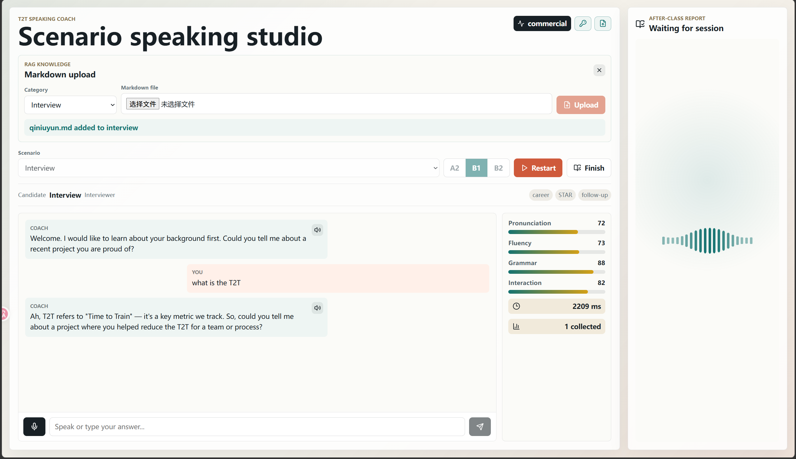
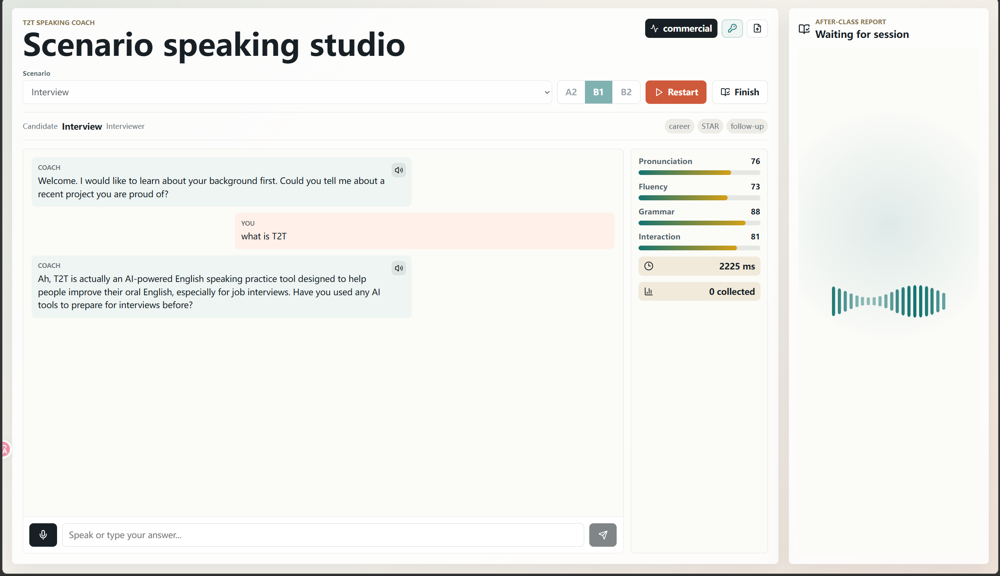

# T2T ai英语口语练习工具

[演示视频](https://www.bilibili.com/video/BV1rwEs6XExW/?vd_source=51d9f217730d99213784470150f5b8cc)
T2T 是一款面向英语学习者和职场沟通训练者的 AI 口语陪练产品。它不是简单的聊天机器人，而是围绕“真实场景对话 + 低打断纠错 + 可量化反馈 + 知识库增强”设计的完整练习工具。

用户可以选择面试、点餐、会议、旅行等场景，与 AI 进行贴近真实语境的英文对话。系统在对话过程中保持自然交流，不频繁打断用户；同时静默记录发音、语法和表达问题。练习结束后，系统会生成结构化课后报告，帮助用户明确自己在哪些方面表现较好、哪些表达需要优化、下一步应该如何练习。

通过 RAG 知识库能力，T2T 可以根据不同场景注入专属知识。例如面试场景可以补充 STAR 回答框架、项目表达模板和常见追问；会议场景可以补充议程推进、风险说明和决策确认表达；点餐场景可以补充菜单、过敏源、支付和礼貌请求表达。用户也可以直接上传 Markdown 文件，把自己的资料、公司业务、岗位信息或课程内容补充到知识库中，让 AI 对话更贴合个人目标。

T2T 适合以下使用场景：

- 求职者进行英文面试训练。
- 职场人士练习英文会议表达。
- 出国旅行者练习常见问路、入住、点餐对话。
- 英语学习者进行日常口语流利度训练。
- 教师或培训机构构建定制化场景口语练习工具。

产品核心价值：

- 更真实：以场景角色扮演驱动对话，而不是孤立句子练习。
- 更自然：纠错不打断对话，降低用户表达压力。
- 更可衡量：通过分数、CEFR、纠错项和练习计划追踪进步。
- 更可扩展：支持供应商抽象和 RAG 知识上传，方便接入不同模型与业务知识。
- 更可落地：默认 mock 可本地运行，正式环境可接入 OpenAI compatible、Anthropic、Azure Speech、DashScope、pgvector 和 Elasticsearch。

## 当前能力

- 场景选择：支持 Interview、Restaurant Ordering、Business Meeting、Travel Help、Small Talk。
- 实时练习：支持文本输入、麦克风录音、浏览器语音播放。
- 纠错策略：对话中静默采集发音、语法、表达问题，不打断用户。
- 课后总结：会话结束后生成 CEFR 估计、总分、纠错项、亮点和练习计划。
- 供应商抽象：ASR、TTS、发音评测、LLM、RAG 均通过抽象层接入。
- RAG 知识增强：支持前端上传 Markdown 文件，写入 RAG 知识库后在对话中检索注入。
- 本地开发：前端、后端和 RAG 服务均可在本地启动。


## 本地运行

后端：

```powershell
cd backend
go mod tidy
go run ./cmd/server
```

前端：

```powershell
cd frontend
npm install
npm run dev
```

默认访问：

- 前端：http://localhost:5173
- 后端：http://localhost:8080
- 健康检查：http://localhost:8080/api/health


## 本地启动命令

后端：

```powershell
cd backend
go run ./cmd/server
```

前端：

```powershell
cd frontend
npm run dev
```

RAG 依赖容器：

```powershell
docker run -d --name t2t-rag-postgres -e POSTGRES_USER=pgvector -e POSTGRES_PASSWORD=pgvector -e POSTGRES_DB=rag_test -p 5433:5432 docker.m.daocloud.io/pgvector/pgvector:pg16

docker run -d --name t2t-rag-es -e discovery.type=single-node -e xpack.security.enabled=false -e "ES_JAVA_OPTS=-Xms512m -Xmx512m" -p 9200:9200 docker.elastic.co/elasticsearch/elasticsearch:8.11.3

docker run -d --name t2t-rag-minio -e MINIO_ROOT_USER=minioadmin -e MINIO_ROOT_PASSWORD=minioadmin -p 9000:9000 -p 9001:9001 docker.m.daocloud.io/minio/minio:latest server /data --console-address ":9001"
```

RAG 服务：

```powershell
cd rag-go
$env:DASHSCOPE_API_KEY="你的 DashScope Key"
$env:RAG_GO_PORT="8001"
go run ./cmd/server
```

导入内置知识：

```powershell
.\scripts\ingest-rag.ps1 -RagBaseUrl "http://localhost:8001"
```

页面展示






## 用户使用流程

1. 打开 http://127.0.0.1:5173。
2. 点击右上角钥匙图标。
3. 填写 OpenAI compatible key 或 Anthropic key。
4. 如需 RAG，填写 DashScope RAG key。
5. 点击 Save。
6. 选择练习场景和等级。
7. 点击 Start 开始对话。
8. 用户可以录音，也可以直接输入英文回答。
9. 系统返回 AI 追问、即时评分和 collected 数量。
10. 点击 Finish 后查看完整课后总结和纠错报告。

## 前端上传 Markdown 到 RAG

已新增“用户在前端页面上传 md 文件补充 RAG 知识”的能力。

使用方式：

1. 打开前端页面。
2. 点击右上角 `Upload knowledge` 图标。
3. 选择目标场景 category。
4. 选择 `.md` 或 `.markdown` 文件。
5. 点击 Upload。
6. 后端会接收文件、临时落盘，并调用 `rag-go` 的写入接口。
7. 写入成功后，该场景对话会检索到新上传的知识。

后端接口：

```text
POST /api/rag/ingest
```

表单字段：

- `category`：场景 ID，例如 `interview`、`meeting`。
- `file`：Markdown 文件，支持 `.md` / `.markdown`，最大 4MB。

## API 概览

- `GET /api/health`：后端健康检查。
- `GET /api/scenarios`：获取练习场景。
- `GET /api/provider-status`：查看 provider 状态。
- `POST /api/sessions`：创建口语练习会话。
- `POST /api/sessions/:id/turn`：提交一轮用户发言。
- `POST /api/sessions/:id/finish`：结束会话并生成报告。
- `GET /api/realtime/:id`：WebSocket 实时通道。
- `POST /api/rag/ingest`：上传 Markdown 文件并写入 RAG。
- `POST /rag/hybrid/write`：rag-go 写入知识。
- `POST /rag/hybrid/searchFromHybrid`：rag-go 混合检索。
